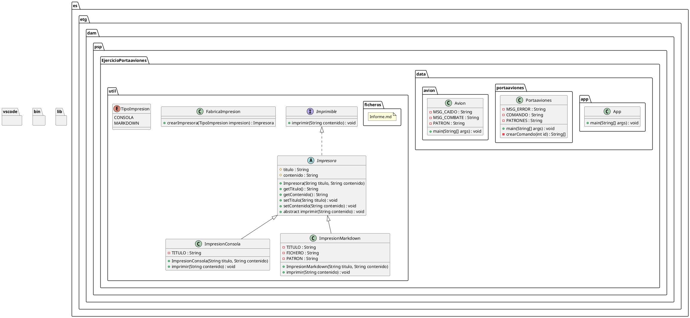

# Ejercicio Portaaviones

## Análisis

### Enunciado

Eres un ingeniero militar encargado de simular las operaciones de un portaaviones. Eres el encargado de dar la orden de **lanzar** la cantidad de cazas que creas necesario para sus misiones correspondientes de manera **INDEPENDIENTE**. Cada avión lanzado se espera un tiempo de entre **3 y 5 segundos** antes de poder dar paso al siguiente y al final lo que tienen que devolver es la caja negra con los siguientes datos:

**`Estado`**: "En pie" si el avión completó su misión o "Derribado" si falló.
**`Bajas enemigas`**: Un número aleatorio entre 1 y 100.
Al final es el **Portaaviones el que recupera las cajas negras** de los aviones y se almacenan los datos en la central del sistema. 

Se entregará un fichero zip, no importa el nombre:

Análisis y Diseño en Markdown (si se requieren imágenes se puede hacer referencia a ellas sin insertarlas en el documento). La extensión de este fichero debe ser .md y su pdf de exportación (si se hace con una herramienta distinta a md se subirá el pdf)
Imágenes utilizadas para el análisis y/o diseño
Código/Pruebas implementadas (se valorará la calidad/claridad/legibilidad del código)
Fichero pdf con el contenido del fichero Markdown.

### Requisitos Funcionales y No Funcionales

#### Requisitos Funcionales

1. **Simulación del Portaaviones:**
   - El sistema debe permitir simular las operaciones de un portaaviones encargado de coordinar misiones aéreas.

2. **Lanzamiento de Cazas:**
   - Debe ser posible lanzar una cantidad de aviones seleccionada por el usuario.
   - Cada avión debe lanzarse de manera **independiente**, respetando un intervalo aleatorio de entre **3 y 5 segundos** entre lanzamientos.

3. **Misión de los Aviones:**
   - Cada avión debe completar su misión y generar una **caja negra** con la siguiente información:
     - **Estado del avión**: "En pie" si completó su misión, "Derribado" si falló.
     - **Bajas enemigas**: Número aleatorio entre 1 y 100.

4. **Recuperación de Cajas Negras:**
   - El portaaviones debe recoger las cajas negras generadas por los aviones una vez finalizadas las misiones.

5. **Almacenamiento de Resultados:**
   - Los datos de las cajas negras deben ser almacenados en el sistema central del portaaviones.

6. **Exportación de Resultados:**
   - Los resultados deben exportarse en un fichero comprimido (`.zip`), incluyendo:
     - Un archivo en formato `.md` con el análisis y diseño del sistema.
     - Las imágenes utilizadas para el análisis y diseño (si las hubiera).
     - El código fuente y pruebas realizadas.
     - Un archivo `.pdf` con el contenido del Markdown exportado.

#### Requisitos No Funcionales

1. **Rendimiento:**
   - El sistema debe procesar el lanzamiento de aviones de manera eficiente, evitando bloqueos o retardos innecesarios.
   - El intervalo entre lanzamientos debe ser aleatorio, pero siempre estar entre **3 y 5 segundos**.

2. **Usabilidad:**
   - La interfaz debe ser clara y permitir al usuario ingresar fácilmente el número de aviones a lanzar.
   - Debe mostrarse en pantalla un resumen de los datos de las cajas negras al finalizar las misiones.

3. **Mantenimiento:**
   - El código debe ser modular, siguiendo principios como separación de responsabilidades y cohesión alta.
   - Debe documentarse adecuadamente para facilitar su entendimiento y futuras modificaciones.

4. **Portabilidad:**
   - El sistema debe ser compatible con entornos estándar de ejecución de Java.

5. **Confiabilidad:**
   - Los datos de las misiones deben almacenarse correctamente en el sistema, asegurando la integridad de la información.

6. **Estilo y Calidad del Código:**
   - El código debe ser claro, comentado, y seguir un estilo consistente (por ejemplo, nombres en camelCase y uso de patrones de diseño cuando sea necesario).
   - El sistema debe ser fácil de compilar y ejecutar, con instrucciones claras para reproducir el proyecto y las pruebas.

## Diseño

